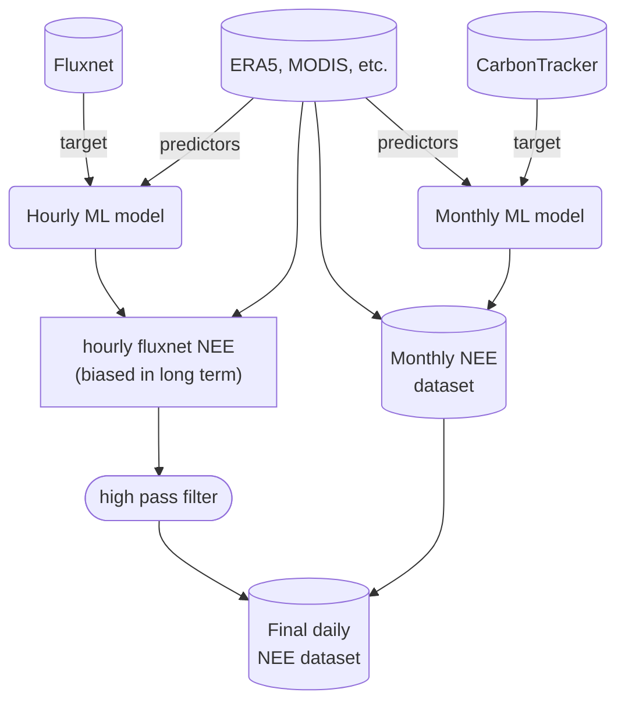

# EXCITED workflow

The following flowchart lays out the workflow of EXCITED:



# Getting started

## Setting up your environment

Install Python 3.10 for your operating system.

Within the `scratch` repository's main folder do:

```bash
python -m venv .venv
```

This creates a python environment. Activate the environment with:

```bash
source .venv/bin/activate
```

Now you can install all the required packages with the following command:

```bash
pip install -r requirements.txt
```

Additionally, to be able to work with the Jupyter notebooks:
```bash
pip install ipython jupyter
```

Now you can run the following command to start jupyter:
```bash
jupyter-notebook
```

## Getting the data

### CarbonTracker
The CarbonTracker data is available from NOAA's Global Monitoring Laboratory. You will need the following files:

- [The Transcom regions file (~2 MB)](https://gml.noaa.gov/aftp//products/carbontracker/co2/regions.nc)
- [The monthly average carbon flux file (~500 MB)](https://gml.noaa.gov/aftp//products/carbontracker/co2/CT2022/fluxes/monthly/CT2022.flux1x1-monthly.nc)

### ERA5
#### Hourly data (Fluxnet model)
Do note that this is a lot of data (~230 GB), and the download will take a long time. 

Change to the folder where you want and run the following command:
With [era5cli](https://github.com/eWaterCycle/era5cli) the ERA5 data can be downloaded using the following command. Do note that this is a lot of data (~230 GB), and the download will take a long time. Do `pip install era5cli` to be able to run the command.

```bash
era5cli hourly \
    --variables 2m_temperature 2m_dewpoint_temperature surface_net_solar_radiation \
    surface_net_thermal_radiation mean_surface_sensible_heat_flux mean_surface_latent_heat_flux \
    surface_pressure total_precipitation \
    --startyear 1995 --endyear 2020 --levels surface \
    --area 60 -140 15 -55
```

#### Monthly data (CarbonTracker model)
For CarbonTracker only monthly data is required. For this data the required storage is 4.2 GB.

Change to the desired folder and run:
```bash
era5cli monthly \
    --variables 2m_temperature 2m_dewpoint_temperature surface_net_solar_radiation \
    surface_net_thermal_radiation mean_surface_sensible_heat_flux mean_surface_latent_heat_flux \
    type_of_low_vegetation type_of_high_vegetation \
    surface_pressure total_precipitation \
    type_of_low_vegetation type_of_high_vegetation \
    --startyear 2000 --endyear 2020 --levels surface \
    --area 60 -140 15 -55
```

### ERA5-land
Similar to ERA5, ERA5-land dataset can be retrieved using `era5cli` as well. For instance:
```bash
era5cli monthly \
    --variables skin_temperature soil_temperature_level_1 soil_temperature_level_2 soil_temperature_level_3 \
    soil_temperature_level_4 volumetric_soil_water_layer_1 \
    volumetric_soil_water_layer_2 volumetric_soil_water_layer_3 \
    volumetric_soil_water_layer_4 \
    --startyear 2000 --endyear 2020 --land --levels surface \
    --area 60 -140 15 -55
```

### Land cover
Land cover classification gridded map describes the land surface into 22 classes. The data is available [here](https://cds.climate.copernicus.eu/cdsapp#!/dataset/satellite-land-cover?tab=overview) and it can be downloaded via CDS.

### SPEI

Standardized Precipitation-Evapotranspiration Index, which in short is SPEI, is a global gridded dataset at time scales between 1 and 48 months and spatial resolution of 0.5 deg lat/lon. It can be downloaded from the following link:
https://digital.csic.es/handle/10261/288226

### Fluxnet

The Ameriflux data was downloaded from the following link https://ameriflux.lbl.gov/data/download-data/

To be able to download the data you need to be registered.

Go through the following steps:

1. Select `AmeriFlux FLUXNET`
2. Select `FULLSET`, `Include BADM`
3. Select all sites.
4. Describe why you want the data, and agree to the policy
5. Download the zip files for all sites, as well as the metadata file `AMF_AA-Flx_FLUXNET-BIF_CCBY4_20221210.xlsx`.
   - Move all the downloaded zip files to a single folder

### MODIS
An introductiona about the MODIS Vegetation Index Products (NDVI and EVI) can be found [here](https://modis.gsfc.nasa.gov/data/dataprod/mod13.php).

MODIS data can be retrieved via the following ways:
- Via the AρρEEARS API (https://appeears.earthdatacloud.nasa.gov/api/?python#introduction)
- Through web service (https://modis.ornl.gov/data/modis_webservice.html)
- Using `MODISTools` (https://cran.r-project.org/web/packages/MODISTools/index.html)

We recommend users to download MODIS data with AρρEEARS API.

## Run the notebooks
Now you can run the notebooks.

- Start with `preprocess_ameriflux.ipynb`. This notebook will preprocess the Ameriflux data to be in a more useful format.
- Next you can preprocess the ERA5 data (extract data per site) with `preprocess_ERA5_sites.ipynb`.
- Now you can train the ML model on the ERA5 and Fluxnet data with `training_a_model.ipynb`.
