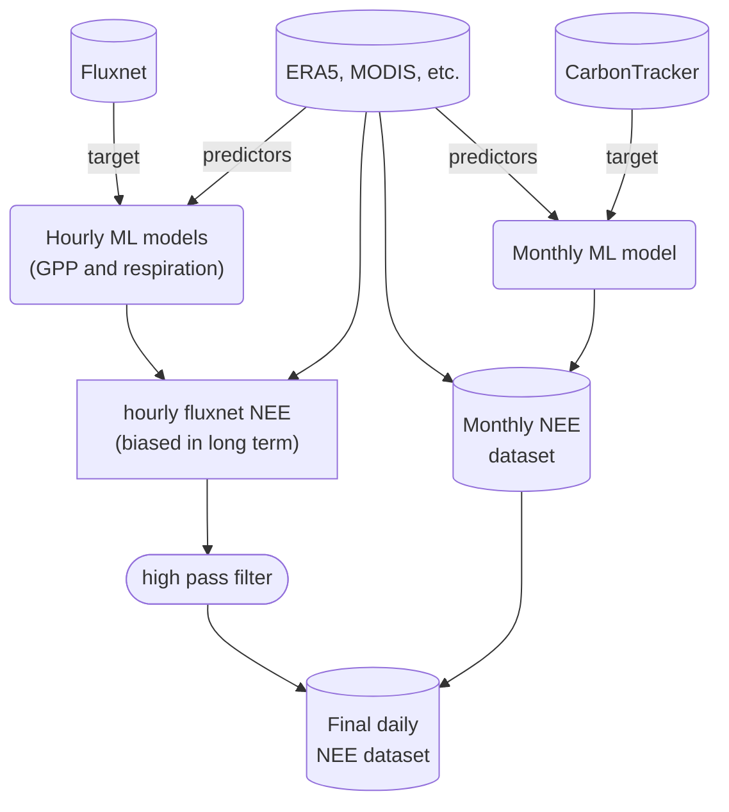

# EXCITED workflow

An open workflow for creating machine learning models for estimating the global biospheric CO2 exchange.

Using this workflow we aim to better constrain the CO2 exchange in terrestrial ecosystems on longer timescales using estimates from inverse models (e.g., CarbonTracker) as additional input data.

For information on how to set up the workflow on your system, see the [setup page](system_setup.md).
The workflow notebooks are all available [here](workflow_notebooks.md).

The following flowchart lays out the workflow of EXCITED:

